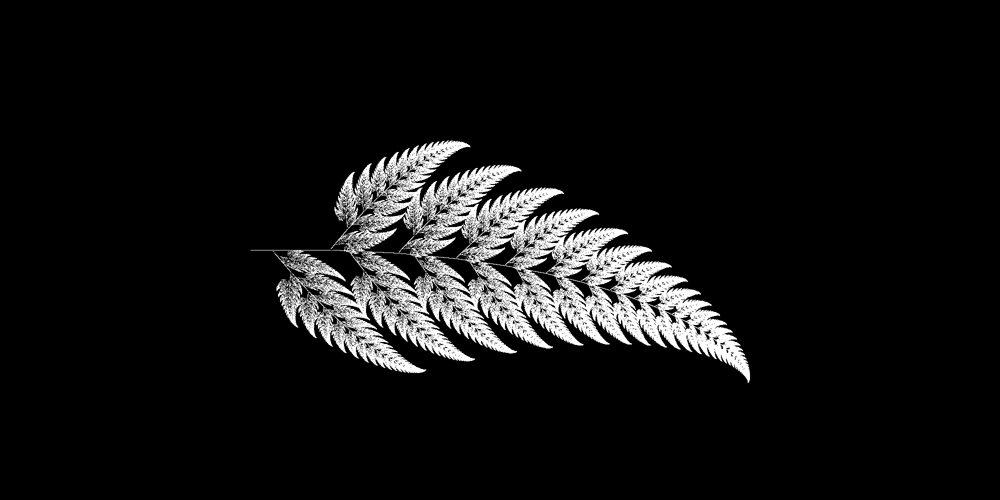
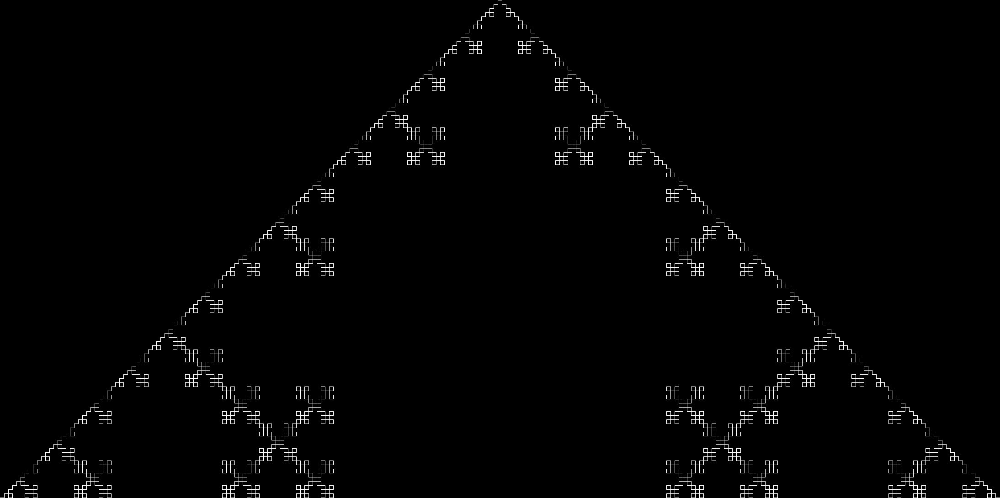
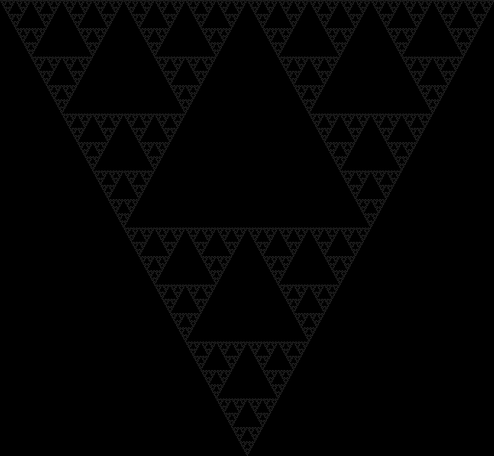
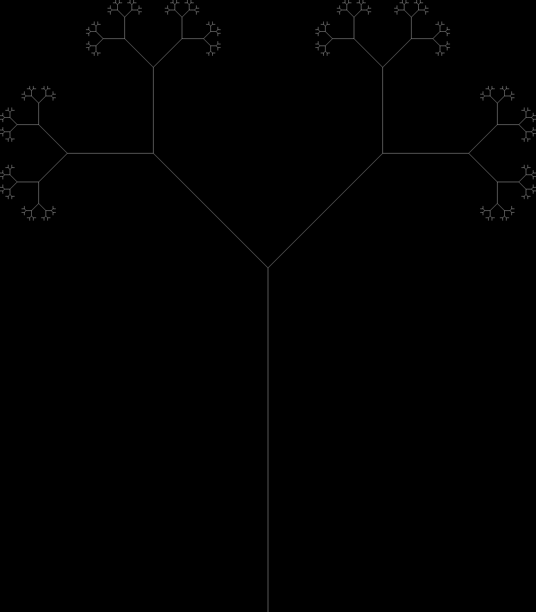

# L-Systems

Initially I found the [simulated growth of plants](https://en.wikipedia.org/wiki/Simulated_growth_of_plants) wiki and thought it showed some nice visualisations. This then led me to [L-Systems](https://en.wikipedia.org/wiki/L-system). Some of the visualisations here are not L-Systems but they looked cool anyway.

## Fern

[Barnsley Fern](https://en.wikipedia.org/wiki/Barnsley_fern)

## Koch

[L-System Koch Curve](https://en.wikipedia.org/wiki/L-system#Example_4:_Koch_curve)

## Sierpinski

[Sierpinski](https://en.wikipedia.org/wiki/L-system#Example_5:_Sierpinski_triangle)

## BTree

[Fractal (Binary) Tree](https://en.wikipedia.org/wiki/L-system#Example_2:_fractal_(binary)_tree)

